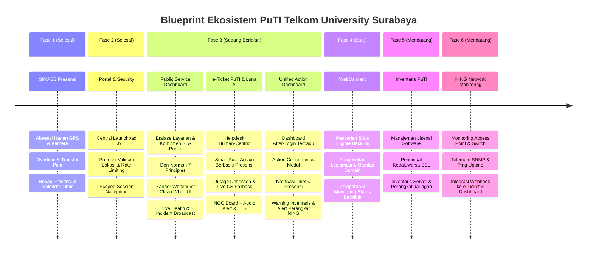

# Blueprint Pengembangan Sistem Terpadu Direktorat PuTI
**Telkom University Kampus Surabaya**

Dokumen ini memetakan arsitektur, fase pengembangan, etika layanan, dan modul ekosistem sistem informasi internal di lingkungan Direktorat PuTI (Pusat Teknologi Informasi) Telkom University Surabaya.

---

## 🧭 Prinsip Etika Layanan & Pengalaman Pengguna (Ethical & UX Pillars)

1. **One Tel-U & Single Point of Contact (SPOC):**
   - Bagi civitas akademika (mahasiswa, dosen, tendik), PuTI Surabaya adalah **satu pintu layanan terpercaya**.
   - Sistem **tidak membebani pengguna** dengan batasan birokrasi, server mana yang rusak, atau dikotomi wilayah ("Surabaya vs Bandung").
2. **Katalog Layanan Berorientasi Pengguna (*Customer-Centric Catalog*):**
   - Form pelaporan dikelompokkan berdasarkan **domain masalah yang dipahami pengguna** (Jaringan, Akun & Akses, Pembelajaran, Perangkat Lab).
   - Penentuan apakah tiket ditangani langsung oleh teknisi lokal atau memerlukan koordinasi ke sistem terpusat dilakukan **secara otomatis di balik layar**.
3. **Bahasa Transparan & Mengayomi (*No Passing the Buck*):**
   - Menghindari kesan melempar tanggung jawab. Jika tiket terkait sistem terpusat (iGracias/M365), status pelapor adalah **"Koordinasi Sistem Terpusat"** dengan pesan pendampingan bahwa tim PuTI Surabaya tetap mengawal tiket hingga selesai.
4. **Etika & Transparansi AI Luna:**
   - Luna transparan sebagai asisten virtual AI dan dilarang meminta atau menyimpan kata sandi/kredensial pengguna.
   - AI bersifat membantu (*enabler*), tidak pernah menolak tiket sepihak.
5. **Keadilan Kerja bagi Teknisi (*Fair & Respectful Workplace*):**
   - Penugasan otomatis **hanya** memilih staf yang hadir (*clocked-in*) di kampus hari ini berdasarkan modul presensi.
   - Timer SLA otomatis di-pause saat menunggu respon pengguna atau koordinasi terpusat agar evaluasi kinerja teknisi adil.
6. **Aksesibilitas & Etika Lingkungan Kerja (NOC Audio):**
   - Notifikasi suara dan Text-to-Speech (TTS) di ruang operasional NOC dilengkapi tombol bisu/mute dan kontrol volume.
7. **Desain Human-Centric & Delightful (Don Norman & Zander Whitehurst Framework):**
   - **7 Prinsip Fundamental Interaksi Don Norman (*The Design of Everyday Things*)**:
     1. *Affordance*: Properti fisik/digital objek yang secara alami menunjukkan cara penggunaannya (tombol terlihat dapat diklik, slider terlihat dapat digeser, form input terlihat dapat diketik).
     2. *Signifiers*: Isyarat perseptual yang jelas yang memberi tahu pengguna *di mana* dan *bagaimana* harus bertindak (label teks tegas "Submit", ikon panah navigasi, badge status semantik berwarna).
     3. *Visibility*: Menjadikan fungsi dan tindakan utama tampak jelas seketika (*above-the-fold*) tanpa menebak atau bergantung pada menu tersembunyi.
     4. *Feedback*: Respon seketika dari sistem yang mengonfirmasi tindakan telah terdaftar (loading spinner, checkmark sukses, toast notification, alert suara responsif).
     5. *Mapping*: Hubungan yang jelas dan logis antara kontrol dan hasil efeknya di dalam sistem (alur input berurutan kiri-ke-kanan, slider volume logis).
     6. *Constraints*: Batasan desain yang membatasi tindakan tidak valid dan mencegah kesalahan pengguna (mendisabled tombol submit sebelum field wajib terisi lengkap).
     7. *Conceptual Models*: Menyelaraskan antarmuka digital dengan model mental dunia nyata pengguna agar sistem terasa akrab, logis, dan intuitif tanpa kurva belajar tinggi.
   - **Estetika & Kaidah UI/UX Modern ala Zander Whitehurst**:
     - *Default White Page Canvas (Clean White First)*: Standar visual bawaan wajib menggunakan kanvas putih bersih (*pure white canvas* `#FFFFFF` dengan aksen netral lembut `#F8FAFC`) untuk memaksimalkan kontras baca, kesan lapang, dan keterbacaan profesional di ruang kerja. Dark mode tetap disediakan sebagai toggle sekunder opsional, bukan default.
     - *Figma-grade Visual Polish*: Layered soft shadows (`0 10px 30px rgba(15,23,42,.06)`), border tipis bergradasi halus (*subtle 1px border stroke*), padding lapang (*generous whitespace*), dan rounded corners modern (16px–24px).
     - *Micro-delight & Motion*: Transisi fluid antar status (150ms–250ms ease-out), hover glow interaktif, dan animasi denyut lembut (*pulse badge*) untuk indikator sistem live/online.
     - *Contemporary Typography*: Hirarki tipografi modern (Inter / Plus Jakarta Sans) dengan kontras tinggi yang memenuhi standar aksesibilitas WCAG AAA.

---

## 🗺️ Roadmap & Fase Pengembangan

---

## 📌 Rincian Modul Per Fase

### Fase 1: SIMASS Presensi ✅ *(Selesai / Aktif)*
- **Fungsi Utama**: Pencatatan kehadiran digital harian staf, dosen, dan student staff PuTI.
- **Fitur Kunci**:
  - Absensi Masuk & Pulang dengan koordinat GPS dan validasi radius kampus.
  - Modul Overtime (Lembur), perhitungan saldo jam kerja, dan transfer poin.
  - Kalender kerja terintegrasi hari libur nasional (`HolidaySeeder`).
  - Rekapitulasi kehadiran bulanan, filter divisi/unit, dan ekspor laporan PDF/Excel.

### Fase 2: Portal Hub & Security Guardrails ✅ *(Selesai / Aktif)*
- **Fungsi Utama**: Single Entry Point (Launchpad) untuk semua sub-sistem PuTI dan penguatan keamanan.
- **Fitur Kunci**:
  - Portal Launchpad (`/portal`) dengan navigasi kartu modul dinamis.
  - Scoped sidebar navigation berbasis sesi (`active_module`).
  - Proteksi anti-mock location, token validasi geofence, dan rate limiting per IP/user.

### Fase 3A: Public Service Dashboard (Etalase Layanan Publik & SLA) 🟡 *(Awal Fase 3 / Sedang Berjalan)*
- **Fungsi Utama**: Antarmuka transparan tanpa login (*public-facing*) bagi civitas akademika dan pihak luar kampus untuk melihat kesiapan layanan IT, katalog layanan resmi beserta komitmen SLA, status gangguan, pemeliharaan terjadwal, dan metrik performa PuTI Surabaya.
- **Penerapan Don Norman 7 Principles**:
  1. **Affordance**: Kartu status modular yang intuitif untuk dieksplorasi, panel detail insiden yang dapat di-expand/klik, dan tombol aksi tegas yang mengarahkan ke pelaporan kendala.
  2. **Signifiers**: Badge status berwarna semantik (*Operational*, *Degraded Performance*, *Under Maintenance*, *Major Outage*), live pulsing dot indikator real-time, dan ikon visual yang memperjelas jenis layanan.
  3. **Visibility**: Ringkasan kesehatan sistem kampus (Wi-Fi, Eduroam, SSO, LMS, Lab) dan target SLA terlihat seketika dalam pandangan pertama (*above-the-fold*) tanpa perlu menebak atau mencari menu tersembunyi.
  4. **Feedback**: Micro-interactions responsif saat elemen disentuh/hover, skeleton loading saat memuat data, serta indikator waktu pembaruan (*"Diperbarui 30 detik lalu"*).
  5. **Mapping**: Tata letak hierarkis yang mengalir logis dan natural dari status sistem agregat kampus $\rightarrow$ status per kategori layanan $\rightarrow$ komitmen SLA $\rightarrow$ riwayat insiden/pemeliharaan.
  6. **Constraints**: Tampilan publik murni *read-only* yang terisolasi dari operasi internal, membatasi input berbahaya dan mencegah kesalahan interaksi.
  7. **Conceptual Models**: Menyelaraskan model mental civitas kampus mengenai layanan TI (mengetahui apakah "Wi-Fi kampus mati" atau "Akun SSO bermasalah") dengan visual status yang mudah dicerna tanpa jargon teknis rumit.
- **Penerapan Zander Whitehurst Aesthetic & Motion**:
  - *Default White Page Canvas (Clean White First)*: Kanvas bawaan wajib berlatar putih bersih (`#FFFFFF` dengan aksen latar `#F8FAFC`) untuk kontras optimal, kejelasan visual, dan kenyamanan mata di lingkungan kerja akademis. Mode gelap tersedia sebagai toggle sekunder.
  - *Figma-grade Visual Polish*: Layered soft shadows (`0 10px 30px rgba(15,23,42,.06)`), border gradasi tipis (*subtle 1px border stroke*), padding lapang (*generous whitespace*), dan rounded corners modern (16px–24px).
  - *Micro-delight & Motion*: Transisi fluid antar status (150ms–250ms ease-out), hover glow interaktif, animasi indikator denyut (*pulse badge*), dan motion cards yang responsif.
- **Fitur Kunci**:
  1. **Public View of Services & Published SLA (Katalog Layanan Publik & Target SLA)**:
     - Daftar katalog layanan resmi PuTI Surabaya (Konektivitas Internet & Wi-Fi, Akun SSO / iGracias, Pembelajaran Daring/LMS, Laboratorium & Perangkat Keras, Server & Web Hosting).
     - Komitmen target SLA tertera eksplisit per kategori (misal: *Insiden Kritis Jaringan Core < 2 Jam*, *Kendala Akses Akun Pribadi < 4 Jam*, *Permohonan Layanan Rutin < 24 Jam*).
     - Pengukur transparansi kepatuhan SLA (*Public SLA Compliance Gauge*, misal: *98.7% On-Time Resolution*).
  2. **Live Service Health Grid**: Indikator status real-time layanan inti PuTI (Jaringan Kampus, SSO/Akun, e-Learning, Server & Web).
  3. **Maintenance & Incident Banner**: Pengumuman jadwal pemeliharaan dan pembaruan berkala insiden yang sedang ditangani.
  4. **Seamless Escalation to Helpdesk**: Signifier / tombol aksi jelas yang mengarahkan pengguna terdampak langsung menuju form e-Ticket PuTI.
  5. **Public SLA & Uptime History**: Grafik transparansi *uptime* 90 hari terakhir sebagai bentuk akuntabilitas layanan PuTI.

### Fase 3B: e-Ticket PuTI & Luna AI 🟡 *(Sedang Berjalan / On-Development)*
- **Fungsi Utama**: Sistem helpdesk terintegrasi, pelaporan kendala IT omni-channel (WhatsApp & Web), penanganan cerdas dengan Luna AI, penerimaan event webhook jaringan dari NING, dan alur pendampingan sistem terpusat.
- **Fitur Kunci**:
  1. **Customer-Centric Service Catalog**:
     - Pengelompokan ramah pengguna: *Jaringan & Internet*, *Akun & Akses Terpadu*, *Aplikasi Pembelajaran*, *Fasilitas & Lab*, *Lainnya*.
     - Pemetaan otomatis kewenangan lokal vs koordinasi terpusat di balik layar.
  2. **Luna AI Conversational & Guardrail Engine**:
     - *Slang to Formal Normalizer*: Memproses bahasa gaul/informal mahasiswa ke istilah teknis terstandarisasi dengan persona mengayomi dan ramah.
     - *Media & Screenshot Ingestion*: Menerima tangkapan layar eror dari WhatsApp/Web dan mengaitkan file ke tiket secara otomatis.
     - *Interactive Clarification*: Menanyakan parameter yang kurang (NIM, lokasi gedung/lantai, nama aplikasi) sebelum membuat tiket.
     - *Guardrails & Privacy*: Perlindungan data pribadi dan pemblokiran input kredensial/password.
  3. **Webhook Ingestion dari NING (Pemisahan Terpisah)**:
     - NING beroperasi sebagai aplikasi terpisah (Fase 6). e-Ticket PuTI hanya bertindak sebagai penerima sinyal (*Webhook Receiver*).
     - *Inbound Outage Webhook*: Saat NING mendeteksi perangkat kritis *down*, e-Ticket otomatis menerbitkan tiket infrastruktur internal ke teknisi jaga tanpa menunggu laporan mahasiswa.
  4. **Outage Broadcast & Deflection Tracking (Metrik Efektivitas)**:
     - *Mass Outage Filter*: Saat NING atau admin mencatat insiden aktif, Luna AI langsung merespons pelapor dengan broadcast status gangguan dan panduan sementara.
     - *Ticket Deflection Logging*: Mencatat interaksi yang terfilter sebagai tiket berstatus `DEFLECTED_OUTAGE` untuk menghitung rasio defleksi (*Deflection Rate KPI*) dan beban kerja yang berhasil dihemat.
  5. **User Data Sync (Phone Identifier)**:
     - Otentikasi identitas berbasis nomor telepon WhatsApp (GET/PUT profil mahasiswa/staf) tanpa membebani login berulang.
     - Notifikasi kepatuhan privasi data transparan sebelum data profil disinkronkan ke database server.
  6. **Smart Assignment Berbasis Presensi**:
     - Membaca data modul presensi hari ini (`Presence::whereDate('date', today())`).
     - Menugaskan tiket lokal hanya ke teknisi yang hadir dengan antrean terendah (*Least-Busy*).
  7. **Human Fallback & Penanganan Kasus Khusus**:
     - **Live Agent Escalation**: Pengalihan sesi langsung ke CS manusia saat pengguna meminta atau AI menemui kebuntuan 2x.
     - **Butuh Klarifikasi (`pending_user`)**: Luna meminta detail gedung/ruang dengan sopan; timer SLA di-pause.
     - **Koordinasi Sistem Terpusat (`waiting_central`)**: PuTI Surabaya bertindak sebagai advokat pendamping lokal, memantau no. rujukan pusat, dan timer SLA di-pause.
     - **Manual Override Staf**: Teknisi memiliki hak penuh mengalihkan rute tiket jika temuan fisik di lapangan berbeda.
  8. **NOC Command Center Board & Audio**:
     - Tampilan visual antrean tiket real-time dengan standar visual Don Norman & Zander Whitehurst.
     - Audio alert (chime) + Browser Native Speech Synthesis (TTS) dengan kontrol bisu/mute.

### Fase 3C: Unified Action Dashboard After-Login 🟡 *(Akhir Fase 3 / Notification & Action Hub)*
- **Fungsi Utama**: Dashboard terpadu setelah pengguna/staf login (*post-login command center*) yang mengonsolidasikan notifikasi cerdas, ringkasan status operasional, serta panduan tugas yang harus segera diselesaikan (*"What To Do Today"*) berdasarkan seluruh modul aktif di ekosistem PuTI.
- **Konsolidasi Notifikasi Lintas Modul (*Cross-Module Action Feed*)**:
  1. **e-Ticket Action Items (`ticket`)**:
     - *Designated Tickets*: Daftar tiket kendala yang ditugaskan (*assigned*) secara spesifik ke teknisi yang sedang login dan menuntut penyelesaian.
     - *Pending User Response*: Peringatan tiket yang telah menerima jawaban tambahan dari pelapor sehingga siap diinvestigasi lebih lanjut.
     - *SLA Breach Warning*: Notifikasi peringatan saat tiket mendekati batas waktu resolusi SLA (< 30 menit).
  2. **SIMASS Presensi Reminders (`presensi`)**:
     - *Presensi Reminder*: Pengingat waktu masuk (*clock-in reminder*) saat tiba di radius kampus dan pengingat pulang (*clock-out reminder*) di akhir jam operasional.
     - *Pending Overtime Approval*: Pengingat bagi koordinator/atasan jika terdapat pengajuan jam lembur staf yang belum disetujui.
     - *Saldo Jam & Status Kehadiran*: Kartu ringkas status absensi hari ini dan akumulasi poin kerja.
  3. **Inventaris PuTI Alerts (`inventaris`)**:
     - *Scheduled Device Maintenance*: Peringatan jadwal pemeliharaan rutin perangkat keras fisik (Server, Switch, UPS, AC Server Room).
     - *Expiring Software License*: Peringatan lisensi perangkat lunak kampus yang mendekati masa habis berlaku (< 30 hari).
     - *Expiring SSL Certificates*: Peringatan kedaluwarsa sertifikat SSL domain/subdomain kampus yang harus segera diperpanjang.
  4. **NING Network Error Alerts (`ning`)**:
     - *Device Error / Down Signal*: Peringatan instan jika sistem NING mendeteksi adanya Access Point, Switch, atau Router kampus yang berstatus error/down atau lonjakan packet loss tinggi yang memerlukan penanganan fisik tim teknisi.
  5. **Quick Action Deep-Links**:
     - Setiap kartu notifikasi menyediakan tombol aksi instan (*direct one-click action*) yang langsung mengarahkan staf ke halaman penyelesaian kendala di masing-masing modul terkait.

### Fase 4: WebOsistant (Web & Outreach Assistant) 🚀 *(Modul Baru)*
- **Fungsi Utama**: Asisten otomasi dan pemantauan strategi web presence, link building, dan legitimasi domain untuk memperkuat otoritas website resmi PuTI Telkom University Surabaya.
- **Fitur Kunci**:
  1. **Eligible Site Discovery (Pencarian Situs Berpotensi)**:
     - Mesin pencari dan katalog situs potensial untuk penempatan backlink berkualitas (media akademik, direktori kampus, jurnal teknologi, portal edukasi, komunitas open source).
     - Filter berdasarkan ceruk/topik (Teknologi Informasi, Smart Campus, Telekomunikasi, Publikasi Riset).
  2. **Legitimacy & Quality Checker (Pengecekan Kredibilitas)**:
     - Verifikasi metrik kesehatan domain: Domain Authority (DA), Page Authority (PA), status SSL, spam score indikator.
     - Deteksi tautan *Dofollow* vs *Nofollow*.
     - Blacklist & Safe Browsing filter: Memastikan situs bebas malware, redirect berbahaya, atau PBN spammy sebelum outreach dilakukan.
  3. **Backlink Monitoring & Lifecycle Tracking**:
     - Pelacakan siklus hidup backlink: `Prospect` $\rightarrow$ `Outreach Sent` $\rightarrow$ `Negotiation` $\rightarrow$ `Placed & Active` $\rightarrow$ `Lost/Broken`.
     - *Automated Health Ping*: Pengecekan berkala apakah backlink yang terpasang masih aktif, status HTTP (200 OK), dan anchor text tidak berubah.
  4. **Reporting & Analytics Dashboard**:
     - Laporan pertumbuhan profil backlink PuTI Surabaya.
     - Grafik distribusi domain (.ac.id, .edu, .org, .com), rasio anchor text, dan histori efektivitas kampanye link.
     - Ekspor laporan bulanan berkala untuk pimpinan.

### Fase 5: Inventaris PuTI ⚪ *(Mendatang / Coming Soon)*
- **Fungsi Utama**: Sentralisasi manajemen aset infrastruktur IT fisik dan digital PuTI Surabaya.
- **Fitur Kunci**:
  - Katalog server fisik, access point, switch, router, dan perangkat lab IT.
  - Tracking lisensi software institusi (jumlah kursi, tanggal aktivasi, perpanjangan).
  - Monitoring sertifikat SSL domain & sub-domain dengan notifikasi peringatan kedaluwarsa otomatis.

### Fase 6: NING (Network Monitoring) ⚪ *(Aplikasi Eksisting / Integrasi Mendatang)*
- **Fungsi Utama**: Sistem pemantauan jaringan operasional PuTI Surabaya yang memantau performa, latensi, dan ketersediaan perangkat keras jaringan (Access Point, Switch, Router, Firewall, Server) di seluruh area Telkom University Surabaya. Aplikasi NING sudah selesai dan berjalan mandiri (*already fixed*), sehingga fase ini murni berfokus pada integrasi jembatan telemetri (*telemetry bridge*) ke e-Ticket PuTI dan Public Service Dashboard.
- **Pemisahan dari e-Ticket (*Decoupled Architecture*)**:
  - **Arsitektur Mandiri**: NING tidak digabungkan (*split*) ke dalam basis kode modul e-Ticket. NING berjalan sebagai layanan terpisah dengan engine monitoring jaringan khusus berbasis SNMP dan ICMP polling.
  - **Protokol Integrasi Webhook & REST API**: Integrasi dilakukan melalui pengiriman event payload JSON saat terdeteksi anomali jaringan (`OUTAGE_DETECTED`, `DEVICE_RESTORED`, `HIGH_LATENCY_WARNING`).
- **Prinsip UI/UX (Don Norman 7 Principles & Zander Whitehurst Aesthetic)**:
  - *Default White Page Canvas*: Tampilan diagram, peta topologi, dan list perangkat menggunakan kanvas putih bersih (`#FFFFFF` dengan aksen `#F8FAFC`) untuk keterbacaan kontras tinggi saat jam operasional teknisi di siang hari.
  - *Affordance & Signifiers*: Node perangkat di peta topologi memiliki signifier status warna tegas (Hijau = Online, Merah = Down, Kuning = High Latency) dengan affordance klik untuk membuka detail diagnostik.
  - *Feedback & Visibility*: Status live ping diperbarui otomatis dengan indikator denyut (*pulse badge*) dan pesan feedback status instan saat melakukan test ping manual.
  - *Mapping & Conceptual Models*: Visualisasi topologi dipetakan sesuai lokasi fisik nyata kampus (Lantai 1, Lantai 2, Laboratorium Komputer, Ruang Dosen) sehingga teknisi langsung mengenali lokasi perangkat di lapangan.
  - *Constraints*: Pengaturan polling rate dan ambang batas sensitivitas diberi batasan nilai aman guna mencegah *network packet flooding*.
- **Fitur Kunci**:
  1. **Live Device Telemetry & Health Polling**:
     - Polling berkala status ketersediaan (*uptime/downtime*) Access Point dan Switch jaringan melalui ICMP ping dan SNMP.
     - Monitoring utilisasi bandwidth port uplink, CPU load router, dan memory usage switch.
  2. **Campus Topology Map & AP Heatmap**:
     - Peta grafis sebaran Access Point per gedung dan per lantai kampus.
     - Indikator densitas client yang terhubung pada setiap SSID Wi-Fi.
  3. **Event-Driven Outbound Webhook ke e-Ticket PuTI**:
     - Saat perangkat kritis *down* (misal: *AP-Lt2-Labkom* mati), NING memicu webhook ke e-Ticket PuTI.
     - e-Ticket PuTI secara otomatis menerbitkan tiket investigasi internal untuk teknisi jaringan serta mengaktifkan *Mass Outage Filter* pada Luna AI.
  4. **Auto-Recovery Signal & Outage Closure**:
     - Saat perangkat terdeteksi pulih dan stabil selama minimal 5 menit, NING mengirimkan sinyal `DEVICE_RESTORED` ke e-Ticket dan Public Service Dashboard untuk memperbarui status insiden secara otomatis.

