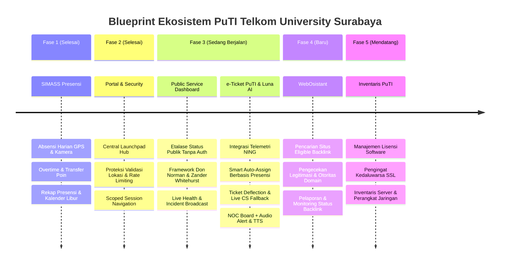

# Blueprint Pengembangan Sistem Terpadu Direktorat PuTI
**Telkom University Kampus Surabaya**

Dokumen ini memetakan arsitektur, fase pengembangan, etika layanan, dan modul ekosistem sistem informasi internal di lingkungan Direktorat PuTI (Pusat Teknologi Informasi) Telkom University Surabaya.

---

## 🧭 Prinsip Etika Layanan & Pengalaman Pengguna (Ethical & UX Pillars)

1. **One Tel-U & Single Point of Contact (SPOC):**
   - Bagi civitas akademika (mahasiswa, dosen, tendik), PuTI Surabaya adalah **satu pintu layanan terpercaya**.
   - Sistem **tidak membebani pengguna** dengan batasan birokrasi, server mana yang rusak, atau dikotomi wilayah ("Surabaya vs Bandung").
2. **Katalog Layanan Berorientasi Pengguna (*Customer-Centric Catalog*):**
   - Form pelaporan dikelompokkan berdasarkan **domain masalah yang dipahami pengguna** (Jaringan, Akun & Akses, Pembelajaran, Perangkat Lab).
   - Penentuan apakah tiket ditangani langsung oleh teknisi lokal atau memerlukan koordinasi ke sistem terpusat dilakukan **secara otomatis di balik layar**.
3. **Bahasa Transparan & Mengayomi (*No Passing the Buck*):**
   - Menghindari kesan melempar tanggung jawab. Jika tiket terkait sistem terpusat (iGracias/M365), status pelapor adalah **"Koordinasi Sistem Terpusat"** dengan pesan pendampingan bahwa tim PuTI Surabaya tetap mengawal tiket hingga selesai.
4. **Etika & Transparansi AI Luna:**
   - Luna transparan sebagai asisten virtual AI dan dilarang meminta atau menyimpan kata sandi/kredensial pengguna.
   - AI bersifat membantu (*enabler*), tidak pernah menolak tiket sepihak.
5. **Keadilan Kerja bagi Teknisi (*Fair & Respectful Workplace*):**
   - Penugasan otomatis **hanya** memilih staf yang hadir (*clocked-in*) di kampus hari ini berdasarkan modul presensi.
   - Timer SLA otomatis di-pause saat menunggu respon pengguna atau koordinasi terpusat agar evaluasi kinerja teknisi adil.
6. **Aksesibilitas & Etika Lingkungan Kerja (NOC Audio):**
   - Notifikasi suara dan Text-to-Speech (TTS) di ruang operasional NOC dilengkapi tombol bisu/mute dan kontrol volume.
7. **Desain Human-Centric & Delightful (Don Norman & Zander Whitehurst Framework):**
   - Mengadopsi 7 pilar Don Norman (*Affordance, Signifiers, Visibility, Feedback, Mapping, Constraints, Consistency*) yang dikombinasikan dengan estetika modern, fluid micro-interactions, dan *visual polish* ala Zander Whitehurst pada etalase layanan publik PuTI.

---

## 🗺️ Roadmap & Fase Pengembangan

---

## 📌 Rincian Modul Per Fase

### Fase 1: SIMASS Presensi ✅ *(Selesai / Aktif)*
- **Fungsi Utama**: Pencatatan kehadiran digital harian staf, dosen, dan student staff PuTI.
- **Fitur Kunci**:
  - Absensi Masuk & Pulang dengan koordinat GPS dan validasi radius kampus.
  - Modul Overtime (Lembur), perhitungan saldo jam kerja, dan transfer poin.
  - Kalender kerja terintegrasi hari libur nasional (`HolidaySeeder`).
  - Rekapitulasi kehadiran bulanan, filter divisi/unit, dan ekspor laporan PDF/Excel.

### Fase 2: Portal Hub & Security Guardrails ✅ *(Selesai / Aktif)*
- **Fungsi Utama**: Single Entry Point (Launchpad) untuk semua sub-sistem PuTI dan penguatan keamanan.
- **Fitur Kunci**:
  - Portal Launchpad (`/portal`) dengan navigasi kartu modul dinamis.
  - Scoped sidebar navigation berbasis sesi (`active_module`).
  - Proteksi anti-mock location, token validasi geofence, dan rate limiting per IP/user.

### Fase 3A: Public Service Dashboard (Etalase Layanan Publik) 🟡 *(Sedang Berjalan / Bersamaan e-Ticket)*
- **Fungsi Utama**: Antarmuka transparan tanpa login (*public-facing*) bagi civitas akademika dan pihak luar kampus untuk melihat kesiapan layanan IT, status gangguan, pemeliharaan terjadwal, dan metrik performa PuTI Surabaya.
- **Penerapan Don Norman 7 Principles**:
  1. **Affordances**: Kartu status modular yang intuitif untuk dieksplorasi, panel detail insiden yang dapat di-expand, dan navigasi langsung ke pelaporan kendala.
  2. **Signifiers**: Badge status berwarna semantik (*Operational*, *Degraded Performance*, *Under Maintenance*, *Major Outage*), live pulsing dot indikator real-time, dan ikon visual yang memperjelas jenis layanan.
  3. **Visibility**: Ringkasan kesehatan sistem kampus (Wi-Fi, Eduroam, SSO, LMS, Lab) terlihat seketika dalam pandangan pertama (*above-the-fold*) tanpa perlu menebak atau mencari-cari.
  4. **Feedback**: Micro-interactions responsif saat elemen disentuh/hover, skeleton loading saat memuat data, serta indikator waktu pembaruan (*"Diperbarui 30 detik lalu"*).
  5. **Mapping**: Tata letak hierarkis yang mengalir natural dari status sistem agregat kampus $\rightarrow$ status per kategori layanan $\rightarrow$ riwayat insiden/pemeliharaan.
  6. **Constraints**: Tampilan publik murni *read-only* yang terisolasi dari operasi internal, membatasi input berbahaya dan mencegah kesalahan interaksi.
  7. **Consistency**: Keseragaman sistem desain (ikonografi, bobot tipografi, label status, dan palet warna) di seluruh komponen dashboard.
- **Penerapan Zander Whitehurst Aesthetic & Motion**:
  - *Figma-grade Visual Polish*: Glassmorphism halus, subtle layered shadows, border gradasi tipis (*subtle strokes*), dan tipografi modern berkarakter kuat.
  - *Micro-delight & Motion*: Transisi fluid antar status, hover glow interaktif, animasi indikator denyut (*pulse badge*), dan motion cards yang responsif.
- **Fitur Kunci**:
  1. **Live Service Health Grid**: Indikator status real-time layanan inti PuTI (Jaringan Kampus, SSO/Akun, e-Learning, Server & Web).
  2. **Maintenance & Incident Banner**: Pengumuman jadwal pemeliharaan dan pembaruan berkala insiden yang sedang ditangani.
  3. **Seamless Escalation to Helpdesk**: Signifier / tombol aksi jelas yang mengarahkan pengguna terdampak langsung menuju form e-Ticket PuTI.
  4. **Public SLA & Uptime History**: Grafik transparansi *uptime* 90 hari terakhir sebagai bentuk akuntabilitas layanan PuTI.

### Fase 3B: e-Ticket PuTI & Luna AI 🟡 *(Sedang Berjalan / On-Development)*
- **Fungsi Utama**: Sistem helpdesk terintegrasi, pelaporan kendala IT omni-channel (WhatsApp & Web), penanganan cerdas dengan Luna AI, integrasi telemetri jaringan NING, dan alur pendampingan sistem terpusat.
- **Fitur Kunci**:
  1. **Customer-Centric Service Catalog**:
     - Pengelompokan ramah pengguna: *Jaringan & Internet*, *Akun & Akses Terpadu*, *Aplikasi Pembelajaran*, *Fasilitas & Lab*, *Lainnya*.
     - Pemetaan otomatis kewenangan lokal vs koordinasi terpusat di balik layar.
  2. **Luna AI Conversational & Guardrail Engine**:
     - *Slang to Formal Normalizer*: Memproses bahasa gaul/informal mahasiswa ke istilah teknis terstandarisasi dengan persona mengayomi dan ramah.
     - *Media & Screenshot Ingestion*: Menerima tangkapan layar eror dari WhatsApp/Web dan mengaitkan file ke tiket secara otomatis.
     - *Interactive Clarification*: Menanyakan parameter yang kurang (NIM, lokasi gedung/lantai, nama aplikasi) sebelum membuat tiket.
     - *Guardrails & Privacy*: Perlindungan data pribadi dan pemblokiran input kredensial/password.
  3. **Integrasi Telemetri NING (Network Monitoring)**:
     - *Live Telemetry Webhook*: Menerima status uptime real-time Access Point, Switch, Router, dan Server dari sistem NING.
     - *Automated Infrastructure Ticket*: Menerbitkan tiket otomatis ke teknisi jaringan saat NING mendeteksi perangkat kritis *down* tanpa menunggu laporan mahasiswa.
  4. **Outage Broadcast & Deflection Tracking (Metrik Efektivitas)**:
     - *Mass Outage Filter*: Saat NING atau admin mencatat insiden aktif, AI langsung merespons pelapor dengan broadcast status gangguan dan SOP sementara.
     - *Ticket Deflection Logging*: Mencatat interaksi yang terfilter sebagai tiket berstatus `DEFLECTED_OUTAGE` untuk menghitung rasio defleksi (*Deflection Rate KPI*) dan beban kerja yang berhasil dihemat.
  5. **User Data Sync (Phone Identifier)**:
     - Otentikasi identitas berbasis nomor telepon WhatsApp (GET/PUT profil mahasiswa/staf) tanpa membebani login berulang.
     - Notifikasi kepatuhan privasi data transparan sebelum data profil disinkronkan ke database server.
  6. **Smart Assignment Berbasis Presensi**:
     - Membaca data modul presensi hari ini (`Presence::whereDate('date', today())`).
     - Menugaskan tiket lokal hanya ke teknisi yang hadir dengan antrean terendah (*Least-Busy*).
  7. **Human Fallback & Penanganan Kasus Khusus**:
     - **Live Agent Escalation**: Pengalihan sesi langsung ke CS manusia saat pengguna meminta atau AI menemui kebuntuan 2x.
     - **Butuh Klarifikasi (`pending_user`)**: Luna meminta detail gedung/ruang dengan sopan; timer SLA di-pause.
     - **Koordinasi Sistem Terpusat (`waiting_central`)**: PuTI Surabaya bertindak sebagai advokat pendamping lokal, memantau no. rujukan pusat, dan timer SLA di-pause.
     - **Manual Override Staf**: Teknisi memiliki hak penuh mengalihkan rute tiket jika temuan fisik di lapangan berbeda.
  8. **NOC Command Center Board & Audio**:
     - Tampilan visual antrean tiket real-time.
     - Audio alert (chime) + Browser Native Speech Synthesis (TTS) dengan kontrol bisu/mute.

### Fase 4: WebOsistant (Web & Outreach Assistant) 🚀 *(Modul Baru)*
- **Fungsi Utama**: Asisten otomasi dan pemantauan strategi web presence, link building, dan legitimasi domain untuk memperkuat otoritas website resmi PuTI Telkom University Surabaya.
- **Fitur Kunci**:
  1. **Eligible Site Discovery (Pencarian Situs Berpotensi)**:
     - Mesin pencari dan katalog situs potensial untuk penempatan backlink berkualitas (media akademik, direktori kampus, jurnal teknologi, portal edukasi, komunitas open source).
     - Filter berdasarkan ceruk/topik (Teknologi Informasi, Smart Campus, Telekomunikasi, Publikasi Riset).
  2. **Legitimacy & Quality Checker (Pengecekan Kredibilitas)**:
     - Verifikasi metrik kesehatan domain: Domain Authority (DA), Page Authority (PA), status SSL, spam score indikator.
     - Deteksi tautan *Dofollow* vs *Nofollow*.
     - Blacklist & Safe Browsing filter: Memastikan situs bebas malware, redirect berbahaya, atau PBN spammy sebelum outreach dilakukan.
  3. **Backlink Monitoring & Lifecycle Tracking**:
     - Pelacakan siklus hidup backlink: `Prospect` $\rightarrow$ `Outreach Sent` $\rightarrow$ `Negotiation` $\rightarrow$ `Placed & Active` $\rightarrow$ `Lost/Broken`.
     - *Automated Health Ping*: Pengecekan berkala apakah backlink yang terpasang masih aktif, status HTTP (200 OK), dan anchor text tidak berubah.
  4. **Reporting & Analytics Dashboard**:
     - Laporan pertumbuhan profil backlink PuTI Surabaya.
     - Grafik distribusi domain (.ac.id, .edu, .org, .com), rasio anchor text, dan histori efektivitas kampanye link.
     - Ekspor laporan bulanan berkala untuk pimpinan.

### Fase 5: Inventaris PuTI ⚪ *(Mendatang / Coming Soon)*
- **Fungsi Utama**: Sentralisasi manajemen aset infrastruktur IT fisik dan digital PuTI Surabaya.
- **Fitur Kunci**:
  - Katalog server fisik, access point, switch, router, dan perangkat lab IT.
  - Tracking lisensi software institusi (jumlah kursi, tanggal aktivasi, perpanjangan).
  - Monitoring sertifikat SSL domain & sub-domain dengan notifikasi peringatan kedaluwarsa otomatis.
